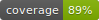

# 🔒 Cryptox

**Cryptox** 是使用 Go 开发的安全套件，包括了常用的对称加密和非对称加密算法，还有散列算法、编解码常用算法等，主要是为了方便相关场景使用。

[Read me in English](./README.en.md)

### 💡 功能特性

* 支持 DES/3DES/AES 等对称加密算法。
* 支持 RSA 等非对称加密算法。
* 支持 ECB/CBC/OFB/CFB/CTR 等分组模式。
* 支持 PKCS5/PKCS7/ZERO 等填充方式。
* 支持 MD5/SHA1/SHA256/SHA512/HMAC 等散列算法。
* 支持 HEX/BASE64 等编解码算法。

_历史版本的特性请查看 [HISTORY.md](./HISTORY.md)。未来版本的新特性和计划请查看 [FUTURE.md](./FUTURE.md)。_

### ⚙ 使用方式

$ go get -u github.com/FishGoddess/cryptox

### 🎨 贡献者

如果您觉得 cryptox 缺少您需要的功能，请不要犹豫，马上参与进来，发起一个 _**issue**_。

### 💪 使用 cryptox 的项目

| 项目  | 作者  | 描述  | 链接                  |
|-----|-----|-----|---------------------|
|     |     |     | [Github]() / [码云]() |

最后，我想感谢 JetBrains 公司的 **free JetBrains Open Source license(s)**，因为 cryptox 是用该计划下的 Idea / GoLand 完成开发的。

